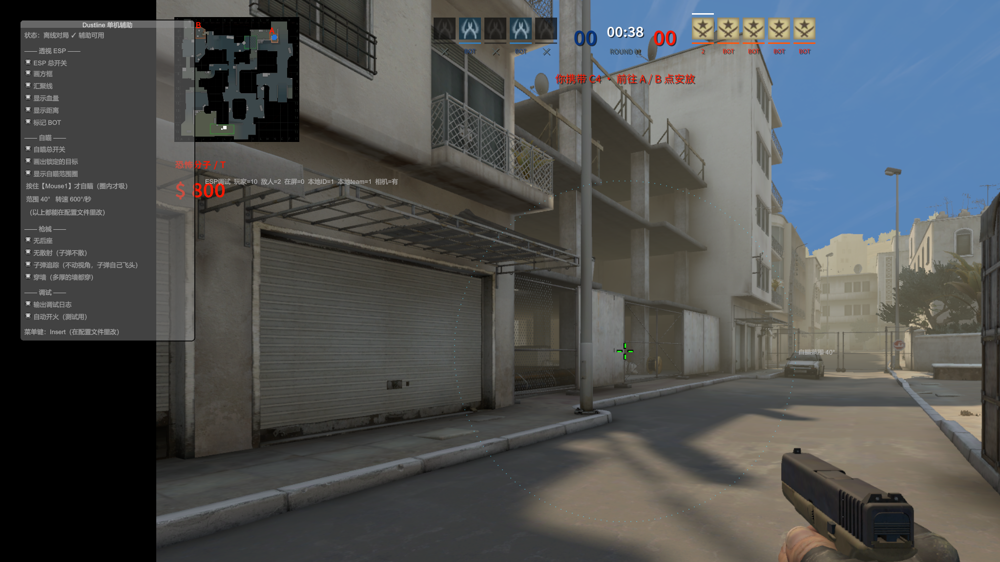

# Dustline Mod — 单机辅助

给 **Dustline 0.6.6** 写的 BepInEx 插件：**透视 ESP + 自瞄（带范围圈）+ 穿墙 + 无后座 + 无散射**。

> ⚠️ **仅用于单机打 BOT。** 代码里有一道硬性检查：只有离线对局才生效，
> 联机（自建房 / 加入别人房间）时**全部自动禁用**。请不要用它去联机。

---

## 效果



截图里可以看到：敌人红色方框 + 从屏幕上方拉的汇聚线、白色血条、距离与 BOT 标记、
绿色"锁定目标"十字、以及**青色虚线自瞄范围圈**（只有圈内的敌人才会被吸）。

---

## 功能

| 分组 | 选项 | 说明 |
|---|---|---|
| **透视 ESP** | 总开关 / 方框 / 汇聚线 / 血量 / 距离 / BOT 标记 | 隔着墙也能看到敌人在哪 |
| **自瞄** | 自瞄总开关 | **必须按住鼠标右键才生效** |
| | 画出锁定的目标 | 目标上画绿色十字 |
| | 显示自瞄范围圈 | 屏幕上那个虚线圆 |
| | 范围 / 转速 / 准心偏移 | 配置文件里调 |
| **枪械** | 无后座 | 清零后坐力 + 累积 + 精度惩罚 |
| | 无散射 | 子弹完全走准心 |
| | 穿墙 | 多厚的墙都能穿 |

**范围圈的颜色**：青色＝待命，黄色＝按住右键但圈内没敌人，**绿色＝已锁定**。

---

## 安装

需要 **Dustline 0.6.6**（Unity 6 / Mono 版）。

1. 下载 [BepInEx 5.4.23.5 x64 (Mono)](https://github.com/BepInEx/BepInEx/releases/download/v5.4.23.5/BepInEx_win_x64_5.4.23.5.zip)
2. 解压到游戏根目录（和 `Dustline.exe` 同级），应该得到：
   ```
   Dustline.exe
   winhttp.dll
   doorstop_config.ini
   .doorstop_version
   BepInEx\
   ```
3. **编译本插件**（见下），或直接用发布页里的 `DustlineAssist.dll`
4. 把 `DustlineAssist.dll` 放进 `BepInEx\plugins\`
5. 启动游戏 → 主菜单点「开始单人训练」→ 游戏里按 **`Insert`** 打开设置窗口

首次启动 BepInEx 会生成 `BepInEx\config\dsh.dustline.assist.cfg`。

---

## 编译

需要 **.NET Framework 的 `csc.exe`**（Windows 自带，路径见脚本）。不需要 Visual Studio。

```powershell
# 游戏装在别处就改这个参数
.\build.ps1 -GameDir "D:\cs"
```

脚本会先确认游戏没在运行（否则 DLL 被占用会编译失败），然后输出到
`<游戏目录>\BepInEx\plugins\DustlineAssist.dll`。

---

## 配置

游戏里按 `Insert` 打开窗口直接勾选；也可以改
`BepInEx\config\dsh.dustline.assist.cfg`（改完重启游戏）。

常调的几项：

| 键 | 默认 | 说明 |
|---|---|---|
| `Aimbot.Fov` | 25 | 自瞄范围（度）。**屏幕上那个圈的半径就是这个角度**。调小更克制 |
| `Aimbot.HoldKey` | Mouse1 | 按住右键才自瞄。设 `None` 会一直自瞄（抢鼠标，不推荐） |
| `Aimbot.Speed` | 600 | 自瞄转速（度/秒）。调小更柔和、鼠标更好控 |
| `Aimbot.HeadOffset` | 0 | 瞄点竖直偏移（米）。**总是打高就填负数**（如 `-0.1`） |
| `Gun.Wallbang` | true | 穿墙 |
| `Debug.Verbose` | false | 打开后会打印 `圈校验` 等诊断日志 |

---

## 文件说明

| 文件 | 说明 |
|---|---|
| `Assist.cs` | **插件本体**（主源码） |
| `Dump.cs` | 反射 dump 工具：把游戏所有类/方法/字段导出成文本，用来定位该 hook 哪里 |
| `build.ps1` | 编译脚本 |
| `辅助说明.md` | 详细文档（实现原理、踩过的坑、排查方法） |
| `screenshots/` | 效果图 |

### 游戏更新后怎么修

游戏大版本更新后类名/方法名可能变动。这时：

1. 用 `Dump.cs` 编译出 dump 插件，放进 `BepInEx\plugins\`
2. 启动一次游戏，会生成一个类型清单
3. 对照日志里"找不到 xxx"的提示，在清单里搜新名字，改 `Assist.cs`

> `Dump.cs` 里的输出路径写死为 `D:\cs\_mod\dump_types.txt`，按需改。

---

## 实现要点

挂钩了这几处（都是运行时反射 + Harmony，不依赖游戏 DLL 编译期引用）：

| 目标 | 用途 |
|---|---|
| `Game.Update`（Prefix） | 无后座 + 自瞄 —— **赶在游戏读输入/生成子弹指令之前** |
| `Match.TraceBullet`（Prefix） | 穿墙：开火前把武器穿透力拉满 |
| `BulletPenetration.Remaining`（Postfix） | 穿墙：穿透余量 → 9999 |
| `BallisticSurface.Named/.For`（Postfix） | 穿墙：材质穿透系数 → 999 |
| `Weapons.SpreadRadius`（Postfix） | 无散射：散布半径 → 0 |
| `ControlInput.Held`（Postfix） | 自动开火（调试用） |

关键数据源：`Game.Instance`（单例）→ `Offline` / `Camera` / `State`，
以及 `Snapshot.Players[]` + `LocalId`。

**视角角度约定**（用 `V3.Aim()` 探针实测得出，非猜测）：

```
Aim(yaw=0, pitch=0)  = (0,0,1)          yaw=0°  → +Z
Aim(yaw=90, pitch=0) = (1,0,0)          yaw=90° → +X
Aim(yaw=0, pitch=45) = (0,-0.707,0.707) pitch>0 → 朝下
```
反解：`yaw = atan2(d.x, d.z)`，`pitch = atan2(-d.y, sqrt(d.x²+d.z²))`

详细原理、踩过的坑、排查方法都在 [辅助说明.md](辅助说明.md)。

---

## 已知限制

- **窗口失焦时游戏会自动暂停**（"单人对局已暂停"）—— 游戏本身机制，不是插件问题。
- **隔墙伤害衰减**是游戏机制，厚墙后的目标本来就要多打几枪。
- **子弹追踪做不了**：子弹方向来自 `Command.Yaw/Pitch`，而 `Command` 是
  结构体，Harmony 前缀拿到的是副本改不动；唯一办法是改视角，那会抢鼠标。
  详见 [辅助说明.md](辅助说明.md#为什么删掉子弹追踪)。

---

## 卸载

删掉这些即可，游戏本体不受影响：

```
winhttp.dll
doorstop_config.ini
.doorstop_version
BepInEx\        （整个文件夹）
```

---

## 声明

- 本插件是基于运行时反射 + Harmony 的**独立实现**，不包含任何游戏原始代码或资源。
- 仅供**单机打 BOT** 使用。用它联机对其他玩家不公平，请不要这么做。
- 请自行确认符合游戏的使用条款；因使用产生的后果由使用者承担。
